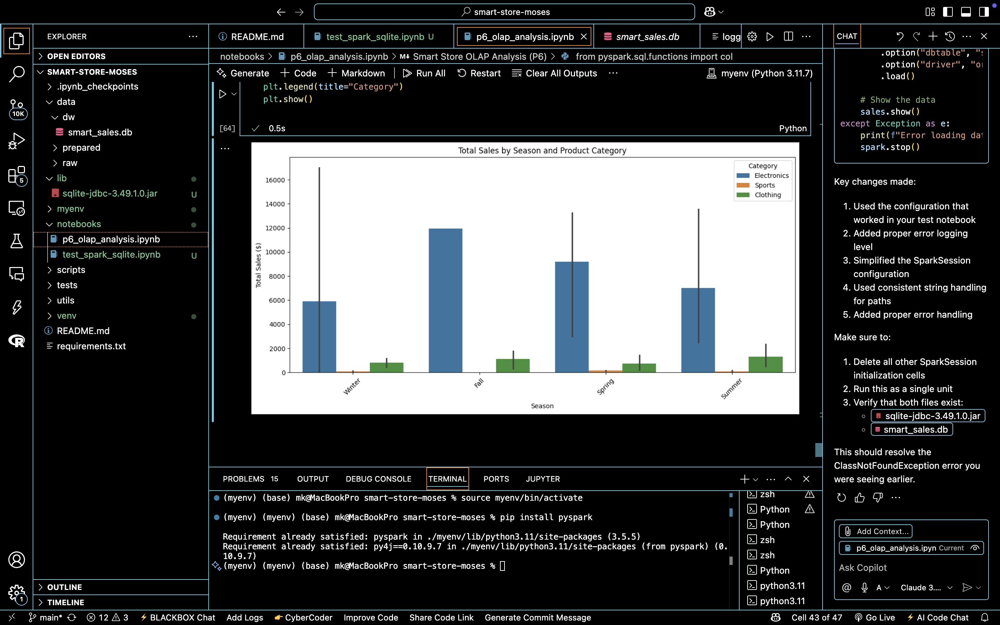

## 📊 P7: Custom BI Project – Smart Sales OLAP Analysis

---

### 1️⃣ Section 1: The Business Goal  
**Goal:**  
Identify the most profitable product categories by season and region using OLAP techniques, and uncover insights that can guide regional inventory planning and seasonal promotions.

---

### 2️⃣ Section 2: Data Source  
- **Database**: `smart_sales.db` (SQLite)  
- **Tables Used**: `sale`, `product`, `customer`  
- **Source**: Cleaned data warehouse created during Project P5  
- **Metrics**: `sale_amount`, `sale_date`  
- **Dimensions**: `region`, `category`, `sale_date` (transformed into `season`)

---

### 3️⃣ Section 3: Tools Used  
- 🐍 **Python**  
- 🔥 **PySpark** for OLAP aggregation  
- 📊 **Seaborn** + **Matplotlib** for visualization  
- 💾 **SQLite** via JDBC connection  
- 💻 Developed in Jupyter Notebook

---

### 4️⃣ Section 4: Workflow & Logic  
- Connected to the SQLite data warehouse using PySpark and JDBC driver  
- Performed inner joins on `sale`, `product`, and `customer` tables  
- Parsed `sale_date` into month and season  
- Aggregated total sales (`sum(sale_amount)`) grouped by `region`, `season`, and `category`  
- Used slicing and dicing to break down insights by region and category  
- Visualized with bar plots for easy pattern recognition

---

### 5️⃣ Section 5: Results  

**Narrative Insight:**  
The analysis revealed that:  
- **Electronics** dominate sales in the **East** during **Summer and Spring**  
- **Clothing** sees more traction in **Winter**, especially in the **West**  
- Some categories (e.g., **Sports**) have low regional sales, suggesting targeted promotion opportunities  

**Visualization Example:**  

> The stacked bar chart shows seasonal distribution of sales by region and category.

---

### 6️⃣ Section 6: Suggested Business Action  
- 🔄 Reallocate inventory based on seasonal trends (e.g., Electronics in the East during Summer)  
- 🛍️ Promote underperforming categories like Sports in low-sales regions  
- 📦 Use historical sales-season insights to fine-tune supply chain planning for peak months  

---

### 7️⃣ Section 7: Challenges  
- Setting up the JDBC connection and loading `.jar` for SQLite in PySpark  
- Parsing inconsistent `sale_date` formats required extra cleaning logic  
- Creating the `season` column accurately from parsed months  
- Ensuring NULLs were handled properly before aggregation

---

### 8️⃣ Section 8: Ethical Considerations  
- Data was anonymized and synthetic; no personal info was used  
- Human oversight was maintained throughout the analysis process  
- Transparency and reproducibility were prioritized in documentation  
- Future BI systems must ensure fairness, especially if customer-level data is included

---
